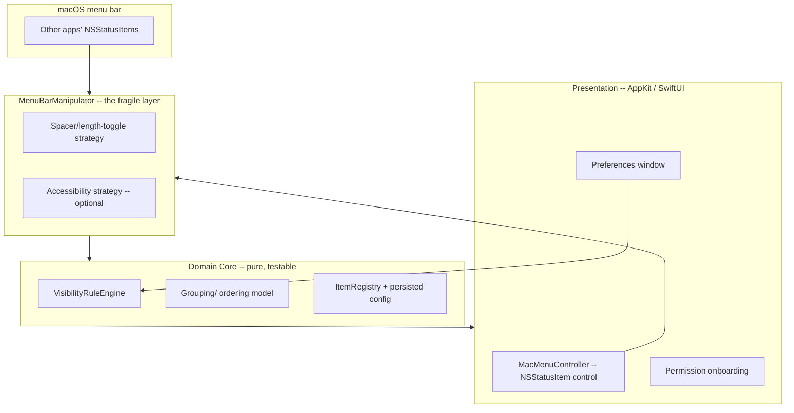

# MacMenu — Technical Design

## Overview

MacMenu is a native macOS menu bar manager (Bartender-style). It hides, reveals, groups, and reorders other apps' menu bar status items. The design isolates the **fragile, unofficial OS-manipulation layer** behind a protocol so the rest of the app (visibility rules, grouping, persistence, UI) stays pure and testable, and so the risky technique can be swapped as macOS changes.

This document also defines the **learning and documentation architecture** (ADRs, docs set, phased plan, prerequisites guide) the owner requested as first-class deliverables.

**Tech stack:** Swift, AppKit (menu bar/status item control) + SwiftUI (preferences). Native macOS, Apple Silicon target.

---

## The central technical problem

macOS provides **no public API** to move/hide/reorder another app's `NSStatusItem`. Bartender-style managers rely on a combination of techniques, each with tradeoffs:

| Technique | What it enables | Permission needed | Risk |
|-----------|-----------------|-------------------|------|
| **Spacer/overlay trick** — MacMenu places its own wide status items to push others off-screen, then toggles their length to reveal/hide | Hiding/revealing without inspecting other apps | None for the trick itself | Most robust historically; ordering control is limited |
| **Accessibility (AXUIElement)** — inspect the menu bar's UI elements to identify/position items | Identifying items, richer control | Accessibility (TCC) | Fragile across OS versions; user must grant |
| **Screen Recording** — capture menu bar pixels to render/identify icons | Showing icons in MacMenu's own UI | Screen Recording (TCC) | Heavy permission; privacy-sensitive |

**Design decision (ADR 0003):** v1 starts with the **spacer/length-toggle approach** for hide/show (lowest permission cost, most durable), and uses **Accessibility only as an optional enhancement** for identification and grouping. The first implementation phase is a **spike** to confirm what actually works on the owner's macOS version before committing. The app must always degrade gracefully and must restore the bar on exit (Requirement 8.2).



---

## Components

| Component | Responsibility | Testable without OS? |
|-----------|----------------|----------------------|
| `MenuBarManipulator` (protocol) | Hide/reveal/position items via a chosen strategy | No (device/integration) |
| `SpacerStrategy` / `AccessibilityStrategy` | Concrete implementations of the manipulator | No |
| `ItemRegistry` | Track discovered items + owning app metadata | Partially |
| `VisibilityRuleEngine` | Decide visible/hidden/always-hidden per item | **Yes** — pure |
| `GroupingModel` | Groups + ordering within MacMenu's region | **Yes** — pure |
| `ConfigStore` | Persist rules/groups/prefs (UserDefaults/JSON) | **Yes** |
| `MacMenuController` | Own status item, toggle hidden region, auto-collapse | Partially |
| `PermissionCoordinator` | Detect/request Accessibility & Screen Recording; degrade gracefully | Partially |

### Threading

- UI inspection/manipulation runs off the main thread where the API allows; all AppKit status-item mutations marshalled to the main thread.
- Per-app inspection wrapped so a hung/quit app is isolated (Requirement 8.1).

---

## Data model

```swift
enum Visibility { case alwaysVisible, hidden, alwaysHidden }

struct ManagedItem: Identifiable, Codable {
    let id: String              // stable key (bundle id + slot heuristic)
    var appName: String
    var bundleId: String?
    var visibility: Visibility
    var groupId: UUID?
    var order: Int
}

struct ItemGroup: Identifiable, Codable { let id: UUID; var name: String; var order: Int }

struct MacMenuConfig: Codable {
    var items: [ManagedItem]
    var groups: [ItemGroup]
    var autoCollapseSeconds: Int?
    var showDockIcon: Bool
    var launchAtLogin: Bool
}

protocol MenuBarManipulator {
    func discoverItems() throws -> [DiscoveredItem]
    func setHidden(_ hidden: Bool, region: HiddenRegion) throws
    func restoreAll() throws        // called on exit/disable (Req 8.2)
}
```

The `VisibilityRuleEngine` and `GroupingModel` operate purely on these value types — fully unit-testable. The `MenuBarManipulator` is the only place that touches the OS.

---

## Visibility & reveal mechanics (spacer strategy, v1)

- MacMenu installs: a **control item** (always visible) and an **expandable spacer** whose width determines whether managed items are pushed off the visible area.
- **Hidden state:** spacer expanded → managed items pushed left of the control / off-screen.
- **Revealed state:** spacer collapsed → managed items shift into view; auto-collapse timer (Requirement 5.3) restores hidden state.
- Item click-through is preserved because items remain real `NSStatusItem`s owned by their apps (Requirement 2.4).
- **Limitation (documented):** precise reordering of another app's native item position isn't guaranteed; ordering is applied within MacMenu's managed region (Requirement 4.4).

---

## Permissions & graceful degradation

- `PermissionCoordinator` checks Accessibility / Screen Recording status at launch.
- If a permission is missing: the spacer-based hide/show still works (no permission needed); identification/grouping enhancements that need AX are disabled with a clear in-app explanation and a deep link to System Settings (Requirements 6.1, 6.2).
- All inspected data stays local (Requirement 6.4).

---

## Stability & restore guarantee

- On quit, crash-recovery, or disable, `restoreAll()` resets spacer widths so other items return to normal (Requirement 8.2). A signal/termination handler ensures restore runs even on unexpected exit where feasible.
- Display/notch/resolution changes trigger a re-layout (Requirement 8.4) via `NSApplication`/screen-change notifications.

---

## Project structure (skeleton)

```
MacMenu/
├── README.md
├── docs/
│   ├── overview.md
│   ├── architecture.md
│   ├── build-and-run.md
│   ├── glossary.md
│   ├── prerequisites-and-learning.md
│   ├── adr/
│   │   ├── 0001-language-and-ui-stack.md
│   │   ├── 0002-app-lifecycle-and-threading.md
│   │   ├── 0003-menu-bar-management-technique.md   # spacer vs AX vs screen recording
│   │   ├── 0004-permissions-and-tcc-model.md
│   │   ├── 0005-persistence-and-config.md
│   │   └── 0006-restore-on-exit-guarantee.md
│   └── phases/
│       ├── phase-plan.md
│       ├── phase-01-spike-and-foundation/{tasks.md,report.md}
│       ├── phase-02-hide-show/{tasks.md,report.md}
│       ├── phase-03-rules-persistence/{tasks.md,report.md}
│       ├── phase-04-grouping-ordering/{tasks.md,report.md}
│       └── phase-05-polish-prefs/{tasks.md,report.md}
├── MacMenu/            # app target
│   ├── App/            # entry point, MacMenuController, AppDelegate
│   ├── Core/           # VisibilityRuleEngine, GroupingModel, ConfigStore, models (pure)
│   ├── MenuBar/        # MenuBarManipulator + Spacer/Accessibility strategies
│   ├── UI/             # preferences, permission onboarding
│   └── Resources/
└── MacMenuTests/       # unit tests for Core (rules, grouping, persistence)
```

---

## Phased delivery plan (skeleton)

Each phase ends runnable, with a `report.md` of what was learned and verified.

1. **Phase 1 — Spike & Foundation:** Xcode project, `LSUIElement`, MacMenu control status item, and a **spike** that proves the chosen hide/show technique works on the owner's macOS version. *Learning: NSStatusItem internals, menu bar layout, run loop.* Produces ADR 0003.
2. **Phase 2 — Hide/Show (Scope A):** spacer strategy, reveal/collapse, auto-collapse timer, restore-on-exit guarantee. Validate by hiding/revealing real menu bar icons.
3. **Phase 3 — Rules & Persistence:** per-item visibility (always-visible/hidden/always-hidden), `ConfigStore`, apply on launch. Pure rule engine unit-tested.
4. **Phase 4 — Grouping & Ordering (Scope B):** groups, ordering within managed region, persisted layout. Grouping model unit-tested.
5. **Phase 5 — Polish & Preferences:** preferences UI, permission onboarding, launch-at-login, Dock-icon toggle, notch/display-change handling, performance.

*(Scope C — search & global keyboard shortcuts — is deferred to a future version and intentionally not planned here.)*

---

## Testing strategy

- **Pure core (unit tests):** `VisibilityRuleEngine` (rule application, precedence), `GroupingModel` (assignment, ordering, reorder stability), `ConfigStore` (round-trip encode/decode, migration).
- **Manipulator integration tests (on device):** discover items, hide/reveal, and — critically — **restore** returns the bar to normal.
- **Manual validation matrix:** documented in the prerequisites guide — how to confirm hide/show/restore on the target macOS version, including the notch case and a multi-display setup.

---

## Key design decisions (to become ADRs)

1. Swift + AppKit/SwiftUI native — chosen for OS learning and the low-level menu bar control AppKit provides.
2. App lifecycle & threading model — `LSUIElement` menu bar app; main-thread status-item mutation.
3. **Menu-bar management technique** — spacer/length-toggle first; Accessibility as optional enhancement; spike-driven decision. *(highest-risk ADR)*
4. Permissions/TCC model — request only what's needed, degrade gracefully.
5. Persistence/config format.
6. Restore-on-exit guarantee — never leave the user's menu bar broken.
